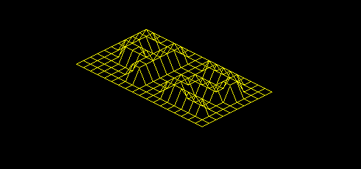

# Fdf - 42 Project.

**Introduction:**

 représentation en relief d’un terrain est une pratique clef de la cartographie moderne.
 Par exemple, en cette ère d’exploration spatiale, avoir une reproduction en trois
 dimensions de la surface de Mars est un prérequis indispensable à la conquête de cette
 planète. Autre exemple, comparer des représentations en trois dimensions d’une zone ou
 l’activité tectonique est importante permet de mieux comprendre ces phénomènes et leur
 évolution, permettant ainsi d’être mieux préparés.
 A vous aujourd’hui de vous essayer à cette pratique et de modéliser de magnifiques
 terrains en trois dimensions, imaginaires ou non...

 **Objectifs:**

 Vous decouvrirez dans ce projet les bases de la programmation graphique, et en particulier,
 le placement de points dans l’espace, comment les relier avec des segments et
 surtout comment observer la scène depuis un certain point de vue.
 Vous découvrirez également votre première bibliothèque graphique : La miniLibX.
 Cette bibliothèque développée en interne rassemble le minimum nécéssaire pour ouvrir
 une fenêtre, allumer un pixel et gérer les évènements lié à cette fenêtre : le clavier, la
 souris et l’“expose”. Ce sera pour vous l’occasion de vous initier à la programmation dite
 “evenementielle”.

 **Exemples:**

